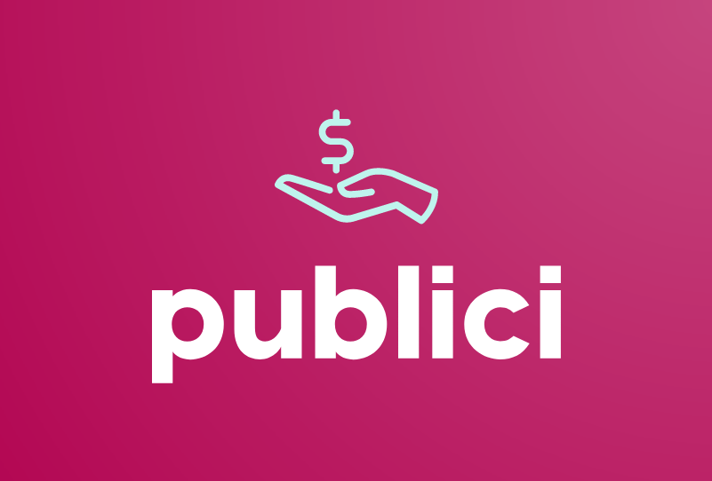

# Publici
On-chain AI agent that generates portfolio snapshot NFT's

 

  

Publici is essentially an on-chain AI-based portfolio report generator. It makes use of an AI agent on Galadriel to generate images that represents a user's crypto portfolio at a particular point of time. The user can choose to mint the generated image as an NFT, which thereby acts as a portfolio snapshot of the user. The AI agent is composed of an LLM and additional tools for web search and image generation. The token balance data is input to the AI agent, which uses web search to identify token value (in USD) and subsequently generate the image. The image can then be minted on-chain as an NFT. Using Galadriel, the entire process takes place on-chain, including AI inference.

 

### Contract deployments

**Galadriel Devnet**

| Contract | Deployment  |
| :----- | :- |
| Manager  | [`0xFe2015aD0c526b5FE44e6098Ef741FfaA2BaE27F`](https://explorer.galadriel.com/address/0xFe2015aD0c526b5FE44e6098Ef741FfaA2BaE27F) |
| Agent | [`0x67Fc3C95dC59C10101AEc68aAcfD245dF3E231FF`](https://explorer.galadriel.com/address/0x67Fc3C95dC59C10101AEc68aAcfD245dF3E231FF)|
| PubliciNFT | [`0x81998f683E40dca0015CD7320CfC6979168AB25b`](https://explorer.galadriel.com/address/0x81998f683E40dca0015CD7320CfC6979168AB25b)|
